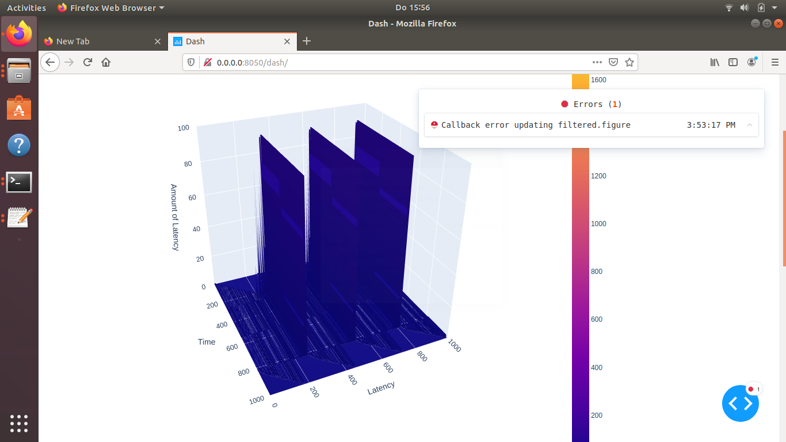

# IIoT monitoring system
This is a performance monitoring system with 3d visualization.

It uses the following technologies:

| Technology | Description |
| ---------- | ----------- |
| Hardware virtualization | Docker |
| API server | Flask |
| Data storage | InfluxDB |
| Data visualization | Plot.ly |
| Data processing | Python |
| Performance metrics collection | Cyclictest open-source |

## Getting started
To run the project refer to the README files in the following directories:

1- [Data Source](data_source) for data aggregation and forwarding

2- [Data Visualization](data_visualization) for data reception and visualization

